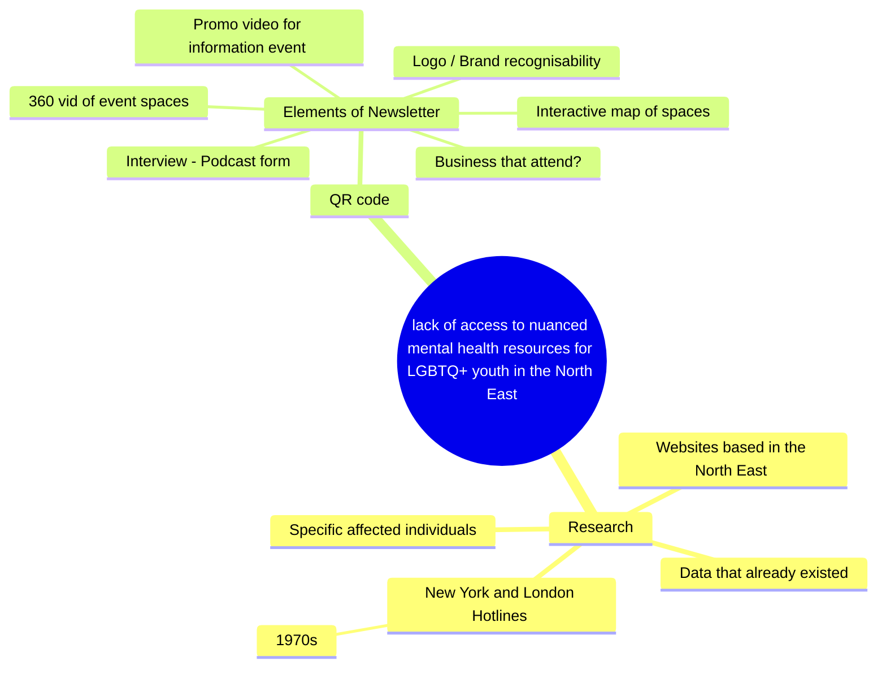

Meeting notes: 15/04
- Go through lauras feedback and create a to-do list 
- Go through github project and add notes into completed tasks 
- Assess the use of an app, in comparison to a phone website - decided we’re going to create on website using html and css on visual studio code
- Assign weekly tasks to people:
  Frankie: start to create website on visual studio code, and continue with app prototype on figma
  Racheal: start to create website on visual studio code, and continue with app prototype on figma
  Clemmie: begin with website on html
  Clemmie and Sacha: continue with interactive map
  Katie: begin on making the presentation of where we are now and writing up findingd of research.  Also make an instagram post. 
  
