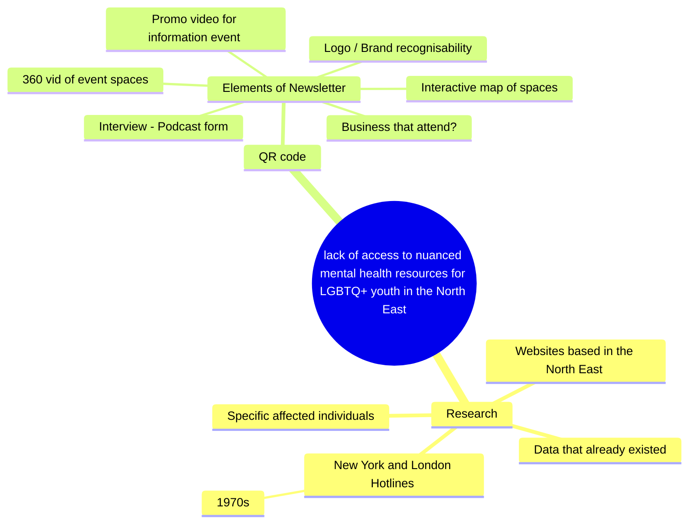

Kate:
Logo 
Research:
Places that are queer friendly 
What people are looking for in a safe space 
Existing products 
Best ways to advertise 
Make flier/poster 
Make instagram account 
Visual identity of the brand 
Make atleast one post for instagram 

Sacha: 
Researching how to use open street map 
Creative interactive map 
360 videos / pictures of safe spaces 
One post for instagram 

Clem: 
Researching how to use open street map 
Creative interactive map 
360 videos / pictures of safe spaces 
One post for instagram 

Frankie: 
Research figma / work out how to use 
Make the app on figma
Make a post for instagram 

Racheal: 
Research figma / work out how to use 
Make the app on figma
Make a post for instagram 


```
Meeting notes: 15/04
- Go through lauras feedback and create a to-do list 
- Go through github project and add notes into completed tasks 
- Assess the use of an app, in comparison to a phone website - decided we’re going to create on website using html and css on visual studio code
- Assign weekly tasks to people:
- Frankie: start to create website on visual studio code, and continue with app prototype on figma
- Racheal: start to create website on visual studio code, and continue with app prototype on figma
-  Clemmie: begin with website on html
-  Clemmie and Sacha: continue with interactive map
- Katie: begin on making the presentation of where we are now and writing up findingd of research.  Also make an instagram post. 

  ``` Next Meeting: 22nd April at Frankie's

```
Meeting itinerary 22/04
- Discussed presentation for progress presentation on 23/04
- Discussed next steps: interviews, wesbite development, design ideas, Instagram posts
- Updating GitHub

```

